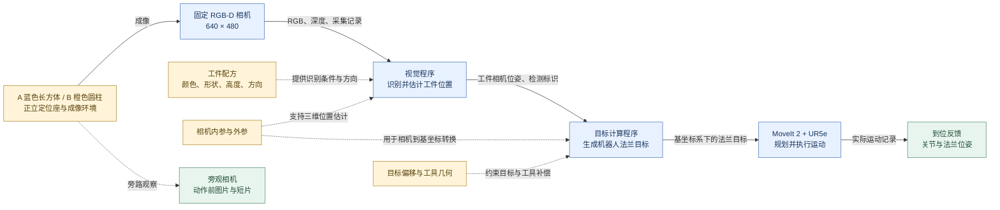

# PICK-A17：最小工位实例模型

状态：2026-09-12，人工依据现有工位、配置和实际运行记录整理的实例模型草图。
本次只建立文档模型，未实现 Agent 自动发现或建模，未启动新的仿真实验。
方向与当前范围见 [图式诊断计划](grasp-diagnosis.md)。

## 工位与任务

- **实例**：PICK-A17，固定 RGB-D 相机、旁观相机、一台 UR5e，以及定位座上的 A/B 工件。
- **对象**：A 为蓝色长方体，B 为橙色圆柱；配方均声明高度 60 mm，正立摆放。
- **任务**：从本次 RGB-D 估计工件位置，按配方生成目标，驱动机器人到位。范围止于到位。
- **参考观察**：[修复后运行记录](../.runtime/gazebo-pick-cell/exports/run-20260912T090708Z-293764aa/bundle.json)。
  本图描述这一实例的功能与关系，不把不同软件版本或不同轮次的数据混在一起。
- **观察方式**：当前诊断产品读取导出的观察包及绑定项目资料；这不等于已接入任意真实工控机、相机或机器人。

## 实例图

实线表示成像、业务数据或反馈；虚线表示声明的配置依赖或旁路观察，具体含义见边标签。
箭头描述关系，不表示这些环节均正常，也不证明某项配置在物理上正确。

**这张图表达了两个当前工位特有的关系：**

1. 相机外参同时参与视觉位置估计与后续目标计算，因此两处数值一致不能独立证明标定物理正确。
2. 工件的位置来自 RGB-D 测量，方向来自工装配方；模型必须保留这两种来源的区别。

## 每条关键关系怎么知道，缺失后影响什么

“运行佐证”仅覆盖所引用的运行；“配置声明”保留其物理适用性仍需核对的边界。

| 关系 | 依据与确认程度 | 缺失或不确定时的诊断影响 |
|---|---|---|
| 工件/环境 → 相机 | 工位场景声明、RGB 与旁观图像共同提供布局和外观线索；局部可见性需逐次检查 | 难以区分目标缺失、遮挡、视角和成像问题 |
| 相机 → 视觉程序 | 采集标识、输入文件摘要、帧时间及相机语义；本次 A/B 对应与摘要均已核对 | 难以检查错帧、过期图像、原始与消费数据差异 |
| 工件配方 → 视觉程序 | 该次运行的颜色、形状、高度、方向配置；检测记录声明其方法和适用假设 | 位置与方向的来源不清，无法判断错误是否由配方假设失效造成 |
| 标定 → 视觉/目标计算 | 相机内参记录、外参配置及程序使用关系；属于声明和使用证据 | 无法可靠解释三维尺度、坐标转换及共同依赖；仍缺独立物理标定检查 |
| 视觉程序 → 目标计算 | 同一工件的采集/检测标识、相机位姿输入；本次 A/B 输入输出标识一致 | 无法确认指令是否使用正确工件、正确轮次的结果 |
| 目标偏移/工具几何 → 目标计算 | 该次配置快照及指令记录中的配置摘要一致 | 无法区分期望工具位置与实际法兰指令、错误偏移和错误补偿 |
| 法兰目标 → 运动执行 → 反馈 | 指令输出与运动记录中目标位姿一致，反馈含实际关节和法兰位姿；本次 A/B 已核对 | 缺少它就难以区分目标计算错误与运动执行偏差；执行符合指令仍不能证明指令目标正确 |
| 现场 → 旁观相机 | 图像/短片及 `before_command` 阶段记录 | 只能支持动作前可见状态，不能据此推断后续动作或工件变化 |

## 展开一条边：相机到视觉程序

以下为本次 A 工件的真实关联，展示实例模型中一条边最少需要保存什么：

| 字段 | 实例内容 |
|---|---|
| 产生方 / 消费方 | 固定 RGB-D 采集 / 视觉程序 |
| 数据 | RGB 图像、深度数组、相机信息、采集记录 |
| 对应标识 | 采集 `capture-40154709e010`；检测 `capture-40154709e010-A` |
| 时间与阶段 | RGB/深度/相机信息均记录为仿真时间 2046.946 秒；动作前 |
| 数据语义 | 记录声明 RGB 与深度配准、深度单位为米且表示光轴方向深度；输出位姿使用相机机体坐标轴约定 |
| 已核对 | 检测引用的四个输入文件摘要与导出文件一致；采集、检测和指令标识可关联 |
| 尚不能据此确认 | 目标身份一定正确、深度数值一定准确、动作前目标不会继续移动 |

这一条边支持检查采集与感知交接，但不会自动把视觉程序或相机标成“正常”。
其他边也采用“关系、语义、证据、确认程度、缺口”的表达。

## Agent 如何使用这张模型

诊断时，图提供取证位置：图像与目标区域在相机/视觉处，配置使用在依赖边上，
任务对应在数据交接处，运动符合性在指令与反馈之间。证据和候选解释分别挂到相关节点或边，
新观察可以修正模型关系或故障判断；当前不存在自动生成这份实例图的验证结果。

当前需保留的未知：标定和工具参数是否独立测量正确、目标是否在采集后变化、不同工况下的识别可靠性。
UTC 文件生成时间与 ROS 仿真采样时间含义不同，不能直接相减解释延迟。
到位任务的外部评价与诊断推理分开，评测私有目标、容差和故障答案不进入实例模型。

## 通用部分与工位部分

- **可复用的框架**：采集、感知、目标计算、执行、反馈，以及对象/时间/坐标/配置的交接约束。
- **本工位填入的内容**：固定 RGB-D、A/B 配方、工装规定方向、法兰目标、UR5e/MoveIt 和现有证据入口。
- **尚未验证的迁移能力**：换为二维相机、随动相机或其他软件组合后，需要调整依赖并重新确认现场关系。
  本图只证明已能整理一个具体实例，尚不证明建模方法在其他工位成立。

## 依据与本次核对

- [工位说明](../harness/gazebo/README.md) 与 [场景定义](../harness/gazebo/scene/pick_cell_world.sdf)：设备布局及固定相机声明。
- [观察清单](../.runtime/gazebo-pick-cell/exports/run-20260912T090708Z-293764aa/bundle.json)：本次读取并核对清单中的 53 个文件摘要。
- [A 采集记录](../.runtime/gazebo-pick-cell/exports/run-20260912T090708Z-293764aa/parts/A/capture/capture.json)、[相机信息](../.runtime/gazebo-pick-cell/exports/run-20260912T090708Z-293764aa/parts/A/capture/camera-info.json)、[视觉输出](../.runtime/gazebo-pick-cell/exports/run-20260912T090708Z-293764aa/parts/A/algorithm/input.json)、[指令](../.runtime/gazebo-pick-cell/exports/run-20260912T090708Z-293764aa/parts/A/algorithm/output.json)、[运动反馈](../.runtime/gazebo-pick-cell/exports/run-20260912T090708Z-293764aa/parts/A/trajectory.json)。B 的对应关系亦已核对。
- [工件配方](../.runtime/gazebo-pick-cell/exports/run-20260912T090708Z-293764aa/project/perception.yaml)、[标定配置](../.runtime/gazebo-pick-cell/exports/run-20260912T090708Z-293764aa/project/cell_calibration.yaml)、[工具配置](../.runtime/gazebo-pick-cell/exports/run-20260912T090708Z-293764aa/project/tool_profile.yaml)：引用该次运行快照。

本次验证是只读核对既有材料及其对应关系，未重新运行机器人或模型；不改变此前诊断准确性结论。
运行材料位于本地 `.runtime`，不随文档自动提交；本节记录的引用在本次核对时有效。
