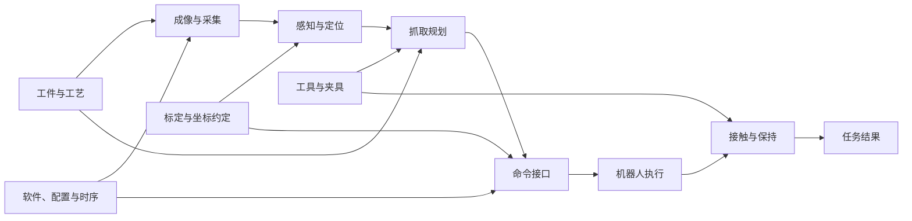

# 抓取场景的多模态诊断 Agent：比赛方案

状态：2026-09-16 加入结构诊断与软件层/源码层两层诊断；实测结果见 [PROGRESS.md](PROGRESS.md)，操作步骤见 [演示指引](grasp-demo.md)。
本文件用于组织方案与讲述，不能代替实验记录或把设计范围当作已演示能力。

范围更新：用户已明确当前建设止于机器人到位，不扩展接触、夹持；下文完整抓取知识与参考图保留为背景，
“方案中的更广能力”不构成当前任务。下一阶段优先记录系统接入、理解与建模，
详见 [最新方向](grasp-diagnosis.md#下一阶段接入系统理解系统系统建模)，尚未实施验收。

## 要解决的问题

一次抓取失败可能表现为抓偏、没到位、空抓或抓住后掉落。相似现象可以来自不同环节：
目标看不清、深度缺失、认错工件、用了旧帧、坐标约定错误、抓取策略不适合、执行偏差或保持力不足。
系统的价值是利用现场证据区分这些解释，并选择能减少不确定性的下一项检查。

比赛聚焦一个固定的视觉引导抓取工位。知识覆盖整个任务，Demo 做实有代表性的故障和处理出口。
不要求百分之百正确；允许保留候选解释、请求补充证据和承认判断失败。

## 从成功条件组织领域知识

| 知识范围 | 要理解的核心关系 |
|---|---|
| 工件与工艺 | 目标身份、材质、形状、允许抓取区域和成功标准 |
| 光学与成像 | 光照、视角、反光、遮挡如何影响可见性与深度 |
| 采集与时序 | 哪一帧被哪次检测/命令消费，数据是否足够新 |
| 识别与定位 | 检测区域、分割、深度和位姿之间的关系，以及形状假设 |
| 标定与几何 | 内外参、坐标系、单位、工具补偿，以及参数与物理实际的差别 |
| 抓取规划 | 抓点、接近方向、可达性、碰撞与工件/夹具约束 |
| 机器人执行 | 指令参考点、控制反馈、轨迹和实际到位 |
| 接触与保持 | 闭合、接触、力或真空、滑移、抬起后的工件运动 |
| 软件与接口 | 数据契约、参数版本、缓存、序列和软件对物理量的使用 |
| 测量与诊断方法 | 误差与不确定性、对照、竞争解释、鉴别检查及排除边界 |

知识给出正常关系、失效机制和鉴别方法。知识本身不产生本案的观察证据。

## 为什么用图

执行有先后顺序，诊断则要处理多因一果、共同依赖和新证据推翻旧判断。
因此以任务依赖图作为检查地图，结论落在具体节点或交接关系上，模型不必从头遍历。

这是任务参考结构，不是自动发现的现场拓扑，也不是已经统计验证的概率因果模型。
当前实现允许在图目标上记录可疑、局部排除和未知，并保存判断依据、检查范围、限制和下一项检查。

## Agent 如何推进

先理解失败现象与成功标准，再提出少量竞争解释，按区分价值选择检查。
图像观察、目标区域深度、采集记录和程序输入输出之间可以相互支持或冲突。
同一条证据只能支持它实际覆盖的范围；到位证据不能证明夹住，全图有效比例不能证明目标深度可靠。

软件问题分两层诊断，门在两层之间：

- **软件层**看运行起来的程序：运行版本、实际加载的配置、模块输入输出、日志，以及记录版本在
  记录输入上的复跑。定位在这一层完成，没有源码也能做到，出口是改配置、带复现输入交开发方或现场处理。
- **源码层**只在软件层把异常定位到承载软件的节点、且源码版本与运行版本一致后开放。
  源码只解释已定位异常的机制并生成补丁；只引用源码的可疑或排除会被宿主降为未查。

这样现场只有发布产物时诊断照样成立，源码注释也无法单独带出一个结论。

**LLM 主导调查，不主导事实。** 图上可计算的一部分由诊断模板表达：方程、变量、测量和故障挂接。
模型把本案记录绑定到模板的测量；宿主用通用结构引擎分析"用这些记录能检测什么、能分开什么、哪些检验可用"，
运行预先实现的残差检验，给出剩余候选、核算排除和当前不可检测的节点，以及下一项能分开候选的测量。
方法对应 FDI 的结构分析（关联矩阵、Dulmage–Mendelsohn 分解、可检测性与可隔离性）加残差检验；
模板是人工整理的参考模型，单故障假设写在输出里。模型引用核算时不能说反话，核算排除的节点也不能打开源码层。

每次检查由工具执行并记录来源。模型结合领域知识解释结果，但数值来自实际测量，结论保留反证与未知。
软件问题可以提出候选并复跑；物理调整交由现场处理；证据不足则明确所需补充材料。
候选重放、实际应用与现场恢复分别验证，不用一次离线成功替代现场回证。

## 当前 Demo 与方案的差距

| 方向 | 当前已实现 | 当前实测范围 | 方案中的更广能力 |
|---|---|---|---|
| 系统图与知识 | 12 节点、17 关系，10 类知识 | 真实模型已查询图/知识并绑定结论 | 扩充不同工件与故障机制 |
| 多模态取证 | 带问题的图像观察、区域 RGB-D、身份/时钟检查、几何核算、多观察来源区分、只读源码 | 实际调用深度对照、旧帧检查及补充侧视，能保留前后不同运行 | 更复杂材质、连续运动和接触证据 |
| 感知 | 已知颜色/形状的位置估计，姿态由工装约束提供 | 两件正立工件的正常到位已通过 | 通用检测、自由姿态和更复杂抓取 |
| 故障对照 | 正常、工具补偿、深度缺失、旧帧、物理遮挡、证据不足 | 实际运行或从实际运行制作对照；遮挡暴露误识别，原诊断失败 | 更丰富工件/材质、接触与复合故障 |
| 判断与处理 | 证据引用、局部检查、可撤回判断；软件层/源码层分层与宿主规则、运行版本复跑、候选命令阶段重放 | 无源码时软件层定位并交接；有源码时开放源码层、补丁落地副本后 Gazebo 复核通过；报告仍有错误表述 | 更稳定的候选辨别与完整感知重放 |
| 结构诊断 | 三个模板（几何指令链、帧对应、RGB-D 交接）、通用结构引擎、七个预实现检验、宿主隔离与两条规则 | 五个真实导出包上，宿主隔离与已知故障类别一致（阈值在看过这些数据后设定）；三组真实模型定位正确并引用核算，机理解读仍有错误；未演示模型按区分建议取证 | 更多模板、模型主动按缺测量补证、复合故障 |
| 任务闭环 | 命令执行和到位反馈 | 到位误差与未生成命令 | 夹持、抬起、滑移和保持的真实验证 |

## 建议的比赛讲述

1. 用相似的“抓取没成功”现象引入多种可能原因，展示抓取系统依赖图。
   几何故障和旧帧消费都是"A、B 没到位，偏 5–7 cm"：结构分析先说明只凭抓取记录，指令计算和机器人可以单独分出，
   感知、帧对应、标定、工件、偏移、工具六者分不开；检验结果随后把两者隔离到不同节点
   （几何故障：指令一致违反 70 mm、到位一致通过；旧帧：指令一致通过、到位一致违反 46–51 mm、帧对应违反）。
2. 在几何软件故障中先不给源码：软件层按内容对比正常运行，得出"配置与感知输入不变、版本变了、
   指令多出 70 mm"，复跑运行版本能复现，出口是交开发方。再给源码：同一定位打开源码层，
   模型解释机制并生成补丁，隔离复跑后经审批落地，最后用新采集的现场运行复核。
3. 在目标深度缺失中，展示原始目标区域有深度、程序消费数据却缺失；仅看 RGB 或全图比例无法区分。
4. 用正常与证据不足对照展示克制：到位正常不等于完成了物理抓取，缺少证据时应继续取证。
5. 展示遮挡误诊及补充实际侧视后的局部改善：模型确认目标仍存在、主视角不可见，但仍未准确指出白板遮挡。
   效果按实际案例报告，不把工具成功或单次答对包装成准确率。

软件案例中，模型生成的最小候选只删除重复工具补偿；隔离复跑后，Codex 按用户已有本地实验授权
通过宿主审批/落地路径应用到专用副本，之后两次重新采集和运动均通过 A/B 到位验收。
这不是正常参考提交冒充模型修复，也不是一次新的人工点击审批。
两次深度诊断均找到原始与消费数据的差异，其中一次仍把具体机制过度归因为配准故障。
这些案例说明图与测量提供了可核对的诊断路径，也暴露模型解释仍有错误；不把案例计数换算成通用准确率。

第六轮在两层结构下重做几何主案例：不读源码时，模型按内容对比正常运行，把异常定位到指令计算并交开发方；读源码时，第 1 轮源码层关闭，软件层定位后第 2 轮开放，补丁同样只删除重复补偿，落地到新的专用副本后Gazebo A/B 到位误差 2.199 / 2.062 mm。深度案例定位到采集交接，机制保留为待证。每组只运行一次，报告中的错误表述见 [第六轮记录](results/grasp-round6-20260916.md)。

外部处理出口目前验证到现场检查建议：侧视案例提示核对主相机的可见性/投影关系和边缘误选。
相机侧视由 harness 根据自审需求采集，未实现 Agent 自主调度相机；未验证推荐调整后的物理恢复。
完整实现通过 174 项测试，证明程序行为约束；模型诊断质量另以真实记录及外部复核说明。

演示应采用已经审查过的实际记录；尚未完成的能力不可由讲稿预先宣称成功。
本次不扩展到多租户、企业权限、规模化调度和通用产线接入，优先完善诊断证据与比赛案例。
