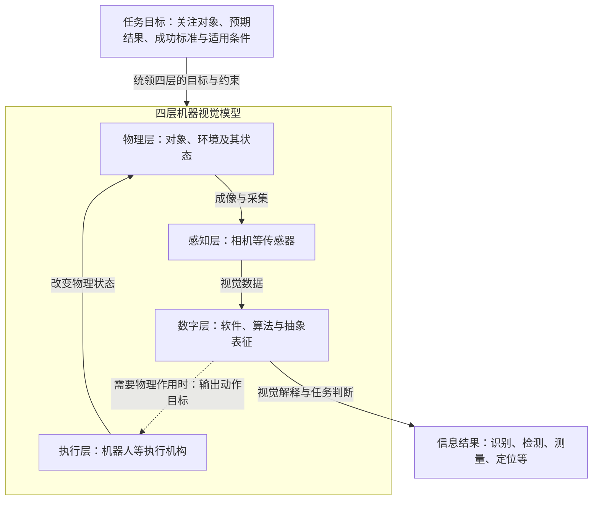

# 机器视觉系统模型快照

版本：v1.0｜日期：2026-09-16｜模型层级：宏观功能架构

本模型采用“任务目标牵引的四层结构”，用于统一描述机器视觉系统的功能边界、信息流与物理作用。系统以视觉数据为主要观测依据，可结合其他传感信息；通过数字处理形成任务结果，并按需通过执行机构作用于物理世界。

模型适用于识别、检测、测量、定位、跟踪和视觉引导等任务，可覆盖二维与三维、静态与动态场景。四层按照功能职责划分，一个设备可以承担多个层的功能。

任务目标是四层共同的牵引与约束，由以下内容描述：

- **关注对象与属性**：系统关注什么对象，以及哪些特征、状态或关系。
- **预期结果**：需要获得什么信息，或达到什么物理状态。
- **成功标准**：结果应满足怎样的准确性、可靠性和时效要求。
- **适用条件**：模型针对的对象范围、环境条件与运行情境。

任务目标决定需要观察什么、获得什么数据、进行什么判断，以及是否需要物理执行。

虚线表示按任务需要启用执行层。图中的信息结果和物理执行可以同时存在。

四层的职责及视觉相关内容定义如下：

| 层 | 核心职责 | 视觉相关内容 |
|---|---|---|
| **物理层** | 描述任务涉及的真实对象、环境及其状态变化。 | 对象的几何、外观、运动等属性，以及光照、遮挡等观测条件。 |
| **感知层** | 通过相机等传感器，将物理世界的信息转换为数字世界的信息。 | 成像、采集与数字化，形成视觉数据；可辅以其他传感信息。 |
| **数字层** | 组织软件、算法与抽象表征，对观测信息进行处理，形成判断、决策与任务结果。 | 将视觉数据关联到对象、空间关系和语义，完成识别、检测、测量、定位等任务。 |
| **执行层** | 通过机器人等执行机构，将数字层结果转化为对物理世界的作用。 | 根据视觉结果，对相应对象或过程实施操作、分选、运动或调节。 |

数字层内部保留三个相互关联的组成：

| 组成 | 宏观定位 |
|---|---|
| **软件** | 组织数据、算法、任务流程和接口，使系统能够协同运行。 |
| **算法** | 承担数据处理、估计、推断、预测与求解。 |
| **抽象表征** | 描述物理对象、场景、状态与关系，并表达任务相关的目标、约束和不确定性。 |

软件承载算法与抽象表征，三者是互补的分析维度。识别、位姿估计等计算归于数字层；即使计算发生在智能相机内部，其功能归属也不改变。

机器视觉的特异性集中体现在两种关系中：

- **成像关系**：物理对象及其状态，在观测条件影响下，通过成像与采集形成视觉数据。模型需要关注任务相关属性是否能够在这些数据中被有效呈现。
- **解释关系**：数字层结合任务目标与已有表征，从视觉数据中推断对象属性、状态、空间关系或语义，形成信息结果及行动依据。

这两种关系贯穿不同的传感形式、算法实现与应用任务，构成该模型在机器视觉领域的共同内容。

模型支持两种使用方式：

| 使用方式 | 系统终点与作用关系 |
|---|---|
| **信息输出** | 以识别结论、检测判断、测量数值或定位结果等为终点；执行层可不启用，或由外部系统承担。 |
| **物理作用与反馈** | 数字结果驱动执行机构改变物理状态；变化被再次感知，并用于调整后续判断或动作时，形成反馈闭环。 |

执行层产生的是物理作用。作用结果被重新观测并用于后续决策，才构成反馈；单次根据视觉结果执行动作，并不自动意味着持续闭环控制。

